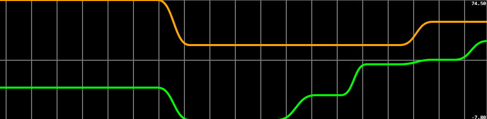

# fiapCap1fase4
#### Não consegui fazer o fork então eu clonei o antigo repositório

### Objetivo

é levar a implementação da FarmTech Solutions da Fase 3 a um novo nível de sofisticação, incorporando o uso do Scikit-learn, Streamlit, Banco de Dados e otimizações no ESP32

O desafio aqui é aprimorar a aplicação desenvolvida na Fase 3, trazendo novas funcionalidades e melhorias no uso de recursos já apresentados nas fases.

Para isso o projeto possui 5 requisitos
1) Incorporar Scikit-learn
2) Implementar Streamlit
3) Adicionar display LCD no Wokwi
4) Monitoramento com Serial Plotter
5) Otimização de Memória no ESP32
#
Os codigos do scikit-learn, streamlit e do wokwi estão na pasta source junto com o dataset utilizado. Os prints do sistema no wokwi e do serial plotter estão na pasta docs.

